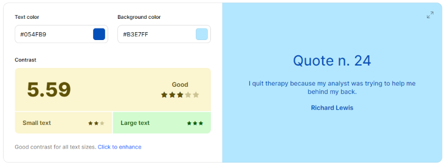

<h1 align="center" id="title">Blue Mountain Development</h1>

This is the main marketing website for Blue Mountain Development. It is designed to be responsive and accessible on a range of devices, making it easy to navigate for potential customers looking for software or web development services.

Blue Mountain Development is a software and web development business based in Cardiff, South Wales, UK. They are looking to attract new potential customers, most, if not all of which, would be business users.

[View the live project here.](https://ant2210.github.io/project1/)

## User Experience (UX) 

-   ### User stories

    -   #### First Time Visitor Goals

    1.  As a First Time Visitor, I want to find out further information about the business and be able to determine as early as possible if the business offers the services that I am looking for. 
    2.  As a First Time Visitor, I want to be able to navigate the site quickly and easily, it should take as few clicks as possible to find the section of the website I am looking for.
    3.  As a First Time Visitor, I want social proof to ensure this is a trusted business, this could be in the form of reviews or links to social media accounts where further information may be available from past and existing customers of the business. 
    4.  As a First Time Visitor, I want to be able to contact the business quickly and easily should I have any further questions that can't be specifically answered by the information on the website. 

    -   #### Returning Visitor Goals

    1.  As a Returning Visitor, I want to be able to find information information about services and past or present projects the business might be working on.
    2.  As a Returning Visitor, I want to be able to contact the business quickly and easily with any questions I might have. 
    3.  As a Returning Visitor, I want to be able to find links to social pages for further research. 

    -   #### Frequent User Goals
    1.  As a Frequent User, I want to keep up to date on any new project the company may have worked on.
    2.  As a Frequent User, I want to see if any new products or services have or are being launched.

-   ### Design
    -   #### Colour Scheme
		The main colour scheme was selected with colour psychology and accessibility in mind. 
		
		-	#### Colour Psychology
			I researched colour psychology and found a very interesting article on Medium.com which can be found [here](https://medium.com/@bloominari/color-psychology-in-web-design-f60656b8f313). The main colour I decided to use was blue. Many tech companies use blue as their main colour as it is thought to be linked with stability, trust, security, intelligence and reliability. Cooler colours are also thought to be linked with professionalism.

		-   #### Colour Accessibility
			After deciding to use blue as the main colour I used Venngage.com to help me choose a colour palette that was attractive as well as meeting the WCAG 2.1 AA guidelines as a minimum and the AAA guidelines where possible.
			
			For further information on these guidelines, you can visit the following link. [Web Content Accessibility Guidelines (WCAG) 2.1 (w3.org)](https://www.w3.org/TR/WCAG21/)

			I also used Coolors.co to double check each colour from the colour palette, as well as ensuring the colours still worked well inversely i.e. a white background with blue text as opposed to a blue background with white text. 

		-   #### Colour Palette and Results
			I have not tested colours #b3c7f7 and #8babf1  as I don't intend on using them in my design. Based on the below results I will aim where possible to use the the darker end of my colour spectrum in areas where text is located as much as possible to try and enhance accessibility as much as possible whilst trying to minimise the effects on the aesthetics of the website. 

			[https://venngage.com/tools/accessible-color-palette-generator#colorGenerator](https://venngage.com/tools/accessible-color-palette-generator#colorGenerator)
            
			
			[https://coolors.co/contrast-checker/ffffff-0073e6](https://coolors.co/contrast-checker/ffffff-0073e6)
			

			[https://coolors.co/contrast-checker/ffffff-0461cf](https://coolors.co/contrast-checker/ffffff-0461cf)
			

			[https://coolors.co/contrast-checker/ffffff-054fb9](https://coolors.co/contrast-checker/ffffff-054fb9)
			

			[https://coolors.co/contrast-checker/0073e6-ffffff](https://coolors.co/contrast-checker/0073e6-ffffff)
			
			
			[https://coolors.co/contrast-checker/0461cf-ffffff](https://coolors.co/contrast-checker/0461cf-ffffff)
			

			[https://coolors.co/contrast-checker/ffffff-054fb9](https://coolors.co/contrast-checker/ffffff-054fb9)
			

            [https://coolors.co/contrast-checker/054fb9-b3e7ff](https://coolors.co/contrast-checker/054fb9-b3e7ff)
            

    -   #### Typography
        I read an article published by Google to help me select my fonts which can be found at the following link [Choosing Web Fonts: A Beginner’s Guide](https://design.google/library/choosing-web-fonts-beginners-guide/). I also read an article from w3schools.com to help me decide on a fallback font should my chosen Google font not be rendered in a users browser. That article can be found at the following link [Best Web Safe Fonts for HTML and CSS](https://www.w3schools.com/cssref/css_websafe_fonts.php).

        - My main font will be Montserrat. This font looks good as small, medium and large sized font, so caters to accessibility. It was also updated in November 2017 and developed Cyrillic support giving a wide array of languages it can be translated into. 

        - For my fallback font I have opted for the Arial font, part of the sans-serif family. It is the most widely used font for both online and printed media. Arial is said to be one of the safest web fonts, and is available on all major operating systems. 

    -   #### Imagery
        -   The imagery I have used was chosen to depict a friendly and approachable but professional office environment. All images used on the main site page were downloaded from [Pexels]( https://www.pexels.com/). 

        -   The screenshots of dummy websites I used on the portfolio page were sourced from [Bootstrap Themes](https://bootstrapthemes.co).

*   ### Wireframes

    Due to the large image sizes and the requirement to zoom into certain elements of the wireframes I haven't embedded them and they can be downloaded from the below links.

    -   Desktop Wireframe can be found at the following link - [Desktop Wireframe](./assets/images/desktopwireframe.png)

    -   Tablet Wireframe can be found at the following link - [Tablet Wireframe](./assets/images/tabletwireframe.png)

    -   Mobile Wireframe can be found at the following link - [Mobile Wireframe](./assets/images/mobilewireframe.png)

*   ### Features

    -   Fully responsive across all screen sizes.
    -   Fully functioning and responsive Navbar, which becomes an off canvase Navbar on smaller screen sizes, operated by a burger icon.
    -   Intuitive and easy to navigate either using the navbar or additional buttons throughout the page.
    -   Introduction section giving a brief summary of the website/businses.
    -   About us section providing further in depth information on the company.
    -   Services section with animated cards which on hover, click or focus tells you more about each service the company offers.
    -   A reviews section which gives the overall star rating, a link to the trusted verfiable review company, along with a carousel of some recent reviews, offering social proof to the website user.
    -   A contact us section with a contact us form, which offers prompts and has minimum requirements before the form can be submitted, to ensure all the information required to contact the user is captured.
    -   A further contact details section should the user want to reach out directly via phone or email, along with social links, the office address and map to the office.
    -   A portfolio page which highlights some recent project. The projects are highlighted on animated cards which when hovered or focused on emerge from behind the other cards and when clicked open a modal with further information on the project, the user can then click on the project image to be taken to the full site of the project. On smaller screen sizes a slider is offered so you can scroll along using a mouse or touch screen.
    -   A responsive footer providing the social links whichever page of the site you are on along with a disclaimer ensuring site visitors know this site is for educational purposes only.

*   ### Accessibility
    -   The use of semantic HTML
    -   Ensuring the colours used across the site offer a high enough contrast
    -   Ensuring all items that can be clicked on or are interactibe by hovering can also be tabbed to
    -   Using descriptive alt tags on all images
    -   Using correct aria labels where necessary
    -   Being mindful in the creation of the design to ensure it is intuitive and easy to navigate as possible

[Back to top](#title)  
[Back to contents](#contents)

## Technologies Used

### Languages Used

-   HTML
-   CSS

### Frameworks, Libraries & Programs Used

-   [Bootstrap](https://getbootstrap.com/) Version 5.3.0 - For the layout and framework of the website, it was also used to create the Navbar, styling and spacing. It was also used for components like the the reviews carousel which was then restyled using my own CSS
-   [Can I Use](https://caniuse.com/) - To check browser support for website features
-   [Cloud Convert](https://cloudconvert.com/) - To compress and convert images to webp
-   [Coolors](https://coolors.co/) - To check contrast and accessibility of the colours I chose to use
-   [Figma](https://www.figma.com/) - To create the wireframs 
-   [Font Awesome](https://fontawesome.com/) - Used for icons used on various parts of the site
-   [Git](https://git-scm.com/) - For version control
-   [GitHub](https://github.com/) - To store website the files and repository for the website
-   [GitPod](https://www.gitpod.io/) - Was used as my IDE to write code, version control using git and pushing changes for storage to GitHub
-   [Google Fonts](https://fonts.google.com/) - To import the fonts I chose for the website
-   Google Dev Tools - Built into the chrome browser to test features and design and troubleshoot as I went along as well as for testing later on
-   [Hover.css](https://ianlunn.github.io/Hover/) - For the underline animation the Navbar links
-   [Logo.com](https://logo.com/) - To create the website logo and favicon
-   [SVG Waves](https://svgwave.in/) - To create the SVG waves used as backgrounds on sections of the website which were then edited myself inside of GitPod
-   [Venngage](https://venngage.com/) - To help choose an accessible colour palette
-   [Website Mockup Generator](https://websitemockupgenerator.com/) - To create the website mockup images at the top of the README
-   Lighthouse - Built into Google Dev Tools for testing
-   [W3C](https://www.w3.org/) - To validate and test HTML and CSS code

[Back to top](#title)  
[Back to contents](#contents)

## Testing

### Manual Testing

Extensive testing was carried out throughout the life cycle of this project. As well as all of the documented testing below I asked friends and family to use the site and tell me what was and wasn't working. 

Besides the bug listed below in [Unsolved Bugs](#unsolved-bugs) involving the Navlinks on iPhones no other major errors with funcionality were discovered. Other than the bug mentioned all of the the following features and functions were tested and found to be working correctly...

-   Main Page
    -   All Navbar links direct the user where expected
    -   On smaller screen sizes the Navbar becomes an off canvas Navbar accessible by the buger icon
    -   The offcanvas Navbar closes when you click away from it or using the X button
    -   Besides the iPhone issue all Navbar links lead where they are supposed to on the website
    -   All buttons on the website lead where they are supposed to on the website
    -   All external links open in a new browser tab
    -   The cards used to display the different services all work on either hover, click, tab, touch (on touchscreen) and will return to their original state when you are no longer interacting or click away
    -   The review carousel buttons work as expected
    -   The contact form does not currently submit data anywhere as there is no backend however from a user perspective all seems to work fine, the form cannot be submitted without all fields being completed, and when submitted the user is directed to the thank you page so they know their message has been sent succesfuly 
    -   Phone tel: and email mailto: links in the contact section both work as expected
    -   The Google map works as expected with all buttons and functions working as expected
    -   Logo in the footer and Navbar both Navigate back tot he top of the home page
    -   Social links in the footer all work as expected and open in a new tab

-   Portfolio Page
    -   All Navbar links direct the user where expected
    -   On smaller screen sizes the Navbar becomes an off canvas Navbar accessible by the buger icon
    -   The offcanvas Navbar closes when you click away from it or using the X button
    -   Besides the iPhone issue all Navbar links lead where they are supposed to on the website
    -   All buttons on the website lead where they are supposed to on the website
    -   All external links open in a new browser tab
    -   The cards used to display the past projectcts all work on either hover, click, tab, touch (on touchscreen) and will return to their original state when you are no longer interacting or click away
    -   The images on each of the cards used to display the past projects work as expected and launch a modal with further information
    -   The buttons within the modal work as expected
    -   Logo in the footer and Navbar both Navigate back tot he top of the home page
    -   Social links in the footer all work as expected and open in a new tab

-   Thankyou Page
    -   All Navbar links direct the user where expected
    -   On smaller screen sizes the Navbar becomes an off canvas Navbar accessible by the buger icon
    -   The offcanvas Navbar closes when you click away from it or using the X button
    -   Besides the iPhone issue all Navbar links lead where they are supposed to on the website
    -   All buttons on the website lead where they are supposed to on the website
    -   All external links open in a new browser tab
    -   Phone tel: link on the page work as expected
    -   Logo in the footer and Navbar both Navigate back tot he top of the home page
    -   Social links in the footer all work as expected and open in a new tab

The site has altogether in one way or another been used and tested on the following devices...

-   Google Pixel 7 - Chrome
-   HP Elitebook (Windows) - Chrome, Edge and Firefox
-   Iphone 11 - Safari and Chrome
-   Ipad - Safari and Chrome
-   Macbook Pro - Safari and Chrome
-   Samsung Galaxy Tab S7 - Chrome and Samsung Browser
-   Samsung S22 Ultra - Edge, Chrome and Samsung Browser

### Testing User Stories from User Experience (UX) Section

-   #### First Time Visitor Goals

1.  As a First Time Visitor, I want to find out further information about the business and be able to determine as early as possible if the business offers the services that I am looking for. 
    -	A short and succinct paragraph right at the top of the homepage outlining what the company does, they should  be able to tell very quickly whether or not the services being offered are what they are looking for, they are then presented with either a button immediately below or a link in the navbar for further information should they want to explor further.
    
2.  As a First Time Visitor, I want to be able to navigate the site quickly and easily, it should take as few clicks as possible to find the section of the website I am looking for. 
    -   As well as the Navbar the users are presented with buttons at the bottom of each section leading them to the next section of the website, the logos on the page also take the user back to the home page as users have come to expect in recent times.
    
3.  As a First Time Visitor, I want social proof to ensure this is a trusted business, this could be in the form of reviews or links to social media accounts where further information may be available from past and existing customers of the business.
    -   The users are presented with many forms of social proof, there is a reviews sections which shows recent reviews as well a link to a trusted review provider where reviews can be authenticated. They are also presented with social media link in the contact us section as well as the footer of the website. There is also a portfolio section where the user can view recent projects the company has worked on for other customers and businesses
    
    
    
    4.  As a First Time Visitor, I want to be able to contact the business quickly and easily should I have any further questions that can't be specifically answered by the information on the website.
    -	There are multiple ways the user could contact the company presented through the website. There is a webform where they can submit a message to the company and once submitted they are presented with a 'thank you page' advising when they company will be in touch. If they don't want to wait this page also provides a phone number.
    -	The user is also presented with a contact details section offering further ways to get in touch via phone, email, mail in person or via various social media pages. The social media pages are also present in the footer of the website.
    
    
    

-   #### Returning Visitor Goals

1.  As a Returning Visitor, I want to be able to find information information about services and past or present projects the business might be working on.
    -   The portfolio section of the website offers varying examples of projects the company has previously worked on
    
2.  As a Returning Visitor, I want to be able to contact the business quickly and easily with any questions I might have. 
    -   There are multiple ways the user could contact the company presented through the website. There is a webform where they can submit a message to the company and once submitted they are presented with a 'thank you page' advising when they company will be in touch. If they don't want to wait this page also provides a phone number.
    -   The user is also presented with a contact details section offering further ways to get in touch via phone, email, mail in person or via various social media pages. The social media pages are also present in the footer of the website.
    
    
    
3.  As a Returning Visitor, I want to be able to find links to social pages for further research. 
    -   The user will be able to find links to all relevant solial pages both in the contact details section as well as the footer of the website.
    

-   #### Frequent User Goals

1.  As a Frequent User, I want to keep up to date on any new project the company may have worked on.
    -   Any new projects the company may have worked on can wither be found in the portfolio page, however most users today would check a companies social pages for the most up to date news and so I have ensured these are prominently displayed and easy to find, a future additional feature I would like to see added to the site however would be a news and or blog section so more up to date information can be more easily shared
    
    
2.  As a Frequent User, I want to see if any new products or services have or are being launched.
    -   The services section can easily be found on the main page of the website and can be navigated from to from the Navbar, any new products or services would be listed here. However as with point one for frequent users 'pre-launch' information nowadays is usually more prominent on a companies social media pages, but again a future implementation could be a blog or news section where this information could be shared also. 
    

### Further Testing
 

-   HTML Validator - [W3C](https://validator.w3.org/)
    -   Homepage

        [Homepage HTML Validator Test 1](./assets/testing/html1.pdf)

        [Homepage HTML Validator Test 2](./assets/testing/html2.pdf)

        -   Warning 1 – h1 element not used as a top line element, I believe this was caused by using an article element inside a section element which from research seems to be redundant, when I changed the article inside the section to a div element the error was resolved. 

        -   Warning 2 – Was in regard to the same section as error 1 not having any heading, again I believe this was due to the way it was structured as this was also resolved by changing the article element to a div. 

        -   Error 4, 6 and 8 were all related to the same error in the HTML structure, once I corrected by removing the redundant article tags the warnings disappeared.

        -   Error 9 was in relation to the 'allowfullscreen' attribute within the iframe of google maps showing as “false”, a quick google search reveals this shouldn’t have a value, so to not allow full screen you should just remove the attribute all together which I have now done and resolved the error.

    -   Portfolio Page

        [Portfolio Page HTML Validator Test 1](./assets/testing/portfoliohtml1.pdf)

        [Portfolio Page HTML Validator Test 2](./assets/testing/portfoliohtml2.pdf)

        -   Warnings 1 and 2 were both caused by the same structure issues as the main page and were resolved in the same way.
        -   Errors 3 to 9 were caused by not linking the 'aria-labelledby' attribute to the id of the labelling element correctly which has now been corrected and has resolved the errors.

    -   Thankyou Page

        [Thankyou Page HTML Validator Test 1](./assets/testing/thankyouhtml1.png)

        [Thankyou Page HTML Validator Test 2](./assets/testing/thankyouhtml2.png)

        -   Warnings 1 and 2 were both caused by the same structure issues as the main page and were resolved in the same way.

 

-   CSS Validator - [W3C](https://jigsaw.w3.org/css-validator/)
    -   Homepage

        [CSS Validator Test 1](./assets/testing/cssvalidator1.png)

        [CSS Validator Test 2](./assets/testing/cssvalidator2.png)

        -   1 error found, missing unit value for the width of the logo in the footer.        
        -   All warnings are in relation to using a vendor extended pseudo-element of extension for various stylings throughout the page which I believe can be ignored in this instance.

 

-   Lighthouse
    
    The main issue with initial testing was page load times due to images sizes and suggested using nextgen formats, I converted the png and jpeg images to webp using [Cloud Convert](https://cloudconvert.com/) to improve performance.

    Accessibility – Serving headings in sequential descending order – I believe this is due to have a 1 page site, so where there is a h2 heading services section, then a h4 and h5 heading respectively, the reviews section further down would then start with a new h2 heading. After some research it would seem this wouldn't cause a problem.

    Lighthouse also suggests using passive listeners to improve scroll performance specifically related to the map function, however I beliebe this would be outside of scope of this project and also outside my capabilities at present.

    Lighthouse also suggests to serve static assets with an efficient cache policy, using long cache policies to improve future load times for users, but this is beyond the scope of the project and again my capabilities but something that could be implemented in future.

    The last warning from Lighthouse suggested that image elements should have explicit width and height to improve CLS (Cumulative Layout Shift). However I have allowed the images to change size to improve the aesthetics on different screen sizes rather than loading a differently sized image on different screensizes which I think would effect page load speeds more.

 

-   Browser Errors
    -   Chrome

        Error with Permissions-Policy header: Origin trial controlled feature not enabled: 'interest-cohort'. – After some research it seems this tells google whether or not you would opt into FLoC and can be safely ignored for the purposes of this project.

    -   Edge

        Edge browser returned the same error as Chrome however as it is built in Chromium this is to be expected.

    -   Firefox

        No errors found

 

### Bugs

-   Bug 1 – Couldn’t make text bold on navbar without moving the other inline elements. There was a solution on Stack Overflow to create a hidden sudo class with the same styling to avoid this, however a simpler method instead which involved less coding and playing round with the structure of the default styling of the Bootstrap navbar was to create a text shadow instead which gives a very similar effect, however this turned out to be a slightly better fix as after playing around with sizing of the shadow and the blur effect I was able to give the text a slightly glowing effect instead of just the bold - [Solution found here](https://pupungbp.com/how-to-give-bold-on-hover-without-shifting-another-element/)

-   Bug 2 – Navbar wouldn’t collapse when a link was clicked. This seems to be a common bug with bootstrap that can be fixed using javascript, however this is beyond my capabilities or scope of this project so instead I opted for an off canvas navbar. I set the width to a maximum of 70% of the viewport width so the user can see that the scrolling has taken them to the correct part of the page, the user can then use the X button or click out of the menu box to view their selected content. I feel this is a more intuitive design as with a drop down menu bar that didn’t “auto-hide” they may not have realised they needed to reclick the menu icon and there was no visual indication the link they had clicked had worked either. 

-   Bug 3 – Section headings hiding behind navbar when clicked – Scroll margin top – [Solution found here](https://www.w3schools.com/cssref/css_pr_scroll-margin-top.php). 
I also discovered later you could just add padding to the body element to clear all content from behind the navbar. Scroll margin top has worked fine for this project but I will bear this in mind for future projects.

-   Bug 4 – On page buttons weren’t working every time after using navbar links for example. [Found solution here](https://stackoverflow.com/questions/2906582/how-do-i-create-an-html-button-that-acts-like-a-link#:~:text=The%20plain%20HTML%20way%20is,URL%20in%20the%20action%20attribute.&text=If%20necessary%2C%20set%20CSS%20display,type%3D%22submit%22%3E%20).
Moved action="#about-us" from the button element it’s self to the parent form element which seems to have fixed the issue.

-   Bug 5 – CSS images not working on deployed site – Didn’t have the correct relative directory path.

-   Bug 6 – Can’t submit form as there is no backend to the website, so the submit button just forwards to the Thankyou page.

-   Bug 7 – The carousel previous and next buttons worked fine but the indicator buttons at the bottom were not, as they were added later on the data-bs-target attribute was targeting the wrong ID for the carousel. Changed to the correct ID now all seem to be working fine.

-   Bug 8 – Images on the cards on the portfolio page were not focusable or tabbable, they could only be interacted with using a mouse. They could be added to the tab index but once tabbed to, the space bar or return key would not launch the modal. Using an 'a' tag instead of a 'div' wouldn’t launch the Modal either. I noticed on the bootstrap documentation all the modals were launched from a button and they were tabbable and would launch using spacebar or return key. As a work around I made the images into buttons, this has no effect to the styling but makes it so the you can interact with the images and therefore better for accessibility.

-   Bug 9 – When the home page images could not load or were unavailable the alt text was unreadable in some places and would also alter the styling and positioning of other text in the same section which could make it unreadable. I instead turned the div into an image container with basic styling to make the alt text more readable and so that it has less of an effect on page styling.

-   Bug 10 - Whilst not a bug as such using [Can I Use](https://caniuse.com/?search=%3A%3A-webkit-scrollbar) it transpired that Firefox doesn't support scrollar styling, however this doesn't detract from the funcionality only really the aesthetics of the site. 

### Unsolved Bugs
 
-   Bug 1 – When asking someone else to test the website functionality for me it was discovered navbar links that used anchor tags to the sections of the home page would only work once the page was refreshed. Links away from the page such as the portfolio page and external links worked fine as well as the home link. This meant whilst you could still navigate the whole website it reduces the user experience on iphone. This issue does not exist on any other apple devices we tested such as macs, laptops or ipads. I tried several fixes but from my research it seems the only fix for this issues requires knowledge of javascript which is beyond my capability as present. 

[Back to top](#title)  
[Back to contents](#contents)

## Deployment

### GitHub Pages

The project was deployed to GitHub Pages using the following steps...

1. Log in to GitHub and locate the GitHub Repository
2. At the top right hand corner of the screen click on your avatar and select 'Your repositories' from the dropdown menu
3. Select the repository you would like to deploy from your list of repositories
4. Near the top centre of the repository (not top of the page), locate and click the settings button on the menu
5. Locate the 'Pages' option on the left hand menu of the settings page
6. Ensure the 'Source' option says 'Deploy from a branch'
7. Under Branch' change the 'None' option to 'main' then press the 'Save' button to the right
8. Under branch it should now say "Your GitHub Pages site is currently being built from the main branch."
9. Wait a few minutes for the page to refresh (this can take upto 5 minutes but usually only 2-3 minutes)
10. You may have to refresh the page at this point, once completed at the top of the page you will see your site it live with the link to the live site. 
11. If you are unsure and want to check the progress you can click on 'Code' along the top menu of the setting (not top of the screen)
12. Under 'Environments' on the right hand side you will see github-pages
13. Clicking this link will tell you if your page is queue, in progress or active.

4. Under "Source", click the dropdown called "None" and select "Master Branch".
5. The page will automatically refresh.
6. Scroll back down through the page to locate the now published site link in the "GitHub Pages" section.

### Forking the GitHub Repository

By forking the GitHub Repository we make a copy of the original repository on our GitHub account to view and/or make changes without affecting the original repository by using the following steps...

1. Login to GitHub
2. Locate the repository, you can use a link you have been provided with or use the search function in the top left of the screen
3. In the top right hand corner of the page locate and click the 'fork' button
4. Near the bottom of the page click the green button that says 'Create Fork'
5. You should now have a copy of the original repository in your GitHub account

### Making a Local Clone

1. Login to GitHub
2. Locate the repository, you can use a link you have been provided with or use the search function in the top left of the screen
3. Near the top of the repository click the green 'Code' button
4. To clone the repository using HTTPS, under HTTPS copy the link provided
5. Open the terminal in your code editor 
6. Change the current working directory to the location where you want the cloned directory to be made
7. Type git clone, and then paste the URL you copied in Step 3
8. Press Enter. Your local clone should be created

[Back to top](#title)  
[Back to contents](#contents)

## Credits

### Code

-   [Abi Harrisons YouTube Video/Webinar](https://www.youtube.com/watch?v=t-4qqmikIqk) - Great tutorial on Meta Tags and Accessibility 
-   [Bootstrap](https://getbootstrap.com/) - Used for the Navbar, page structure, reviews carousel, spacing, padding styling, then restyled for my own purposes
-   [Code Institute](https://codeinstitute.net/) - Besides what I have obviously learnt so far, I used and restyled an example from the Love Running project for the styling of the images of the people on the review cards
-   [Fireship YouTube Channel](https://www.youtube.com/watch?v=29deL9MFfWc) - Followed his tutorial to make the cards for the portfolio page then restyled myself
-   [Hover.CSS](https://ianlunn.github.io/Hover/ ) - Used to create the underline hover effect for Navbar linkss
-   [Pupungbp](https://pupungbp.com/) - Learned how to use text shadows to make bold/glowing text
-   [System 22 Web Design - YouTube Video](https://www.youtube.com/watch?v=SPoy8_ZtvKs) - Learnt how to change the colour of the burger menu icons from Bootstrap using CSS filters
-   [W3 Schools](https://www.w3schools.com/) - Learnt how to use colour gradients, 'scroll-margin-top' and flip cards which were then restyled

All other code was written by the developer

### Content

Content for the website was all written by the developer

### Media

- Logo - Was created by the developer using [Logo.com](https://www.logo.com)
- Images - All images used on the main site page were downloaded from [Pexels]( https://www.pexels.com/). The screenshots of dummy websites I used on the portfolio page were sourced from [Bootstrap Themes](https://bootstrapthemes.co).
- SVG Graphics - SVG graphics were created using [SVG Waves](https://svgwave.in/)

### Acknowledgements

I 100% couldn't have completed this project on my own so would like to acknowledge the following people for their contributions, whether they know they helped or not...

-   My Fiance and children not complaining about my neglecting them in the evenings and weekened
-   [Code Institute](https://codeinstitute.net/) for the opportunity they have provided
-   [Iris Smok](https://github.com/Iris-Smok) my cohort facilitator for her support and for checking in on me when I have had to take some time away from the keyboard
-   [Martina Terlevic](https://github.com/SephTheOverwitch) for her advice and support
-   Delyth Jennings for reviewing my project and discovering the iphone issue
-   The rest of my cohort for reviewing my work and encouragement (too many to name individually sorry)
-   [Kera Cudmore](https://github.com/kera-cudmore) You don't know you helped me but I found your README on one of the slack channels which was a great source of inspiration and also lead me to [Abi Harrisons YouTube Video/Webinar](https://www.youtube.com/watch?v=t-4qqmikIqk) which was a great resource too

[Back to top](#title)  
[Back to contents](#contents)
